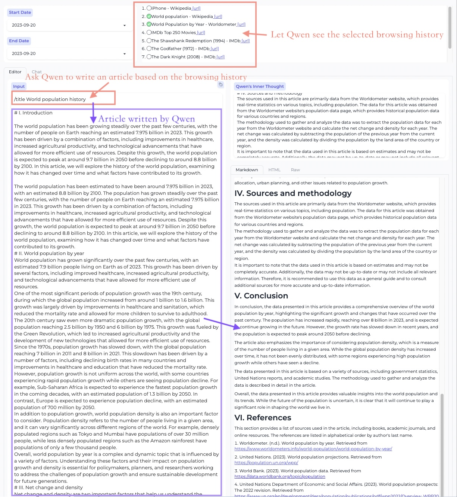
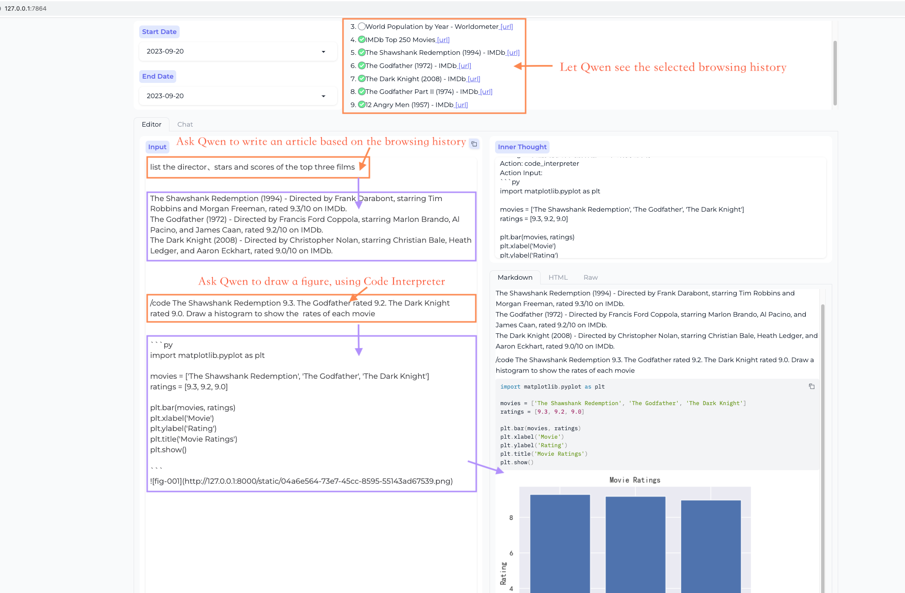
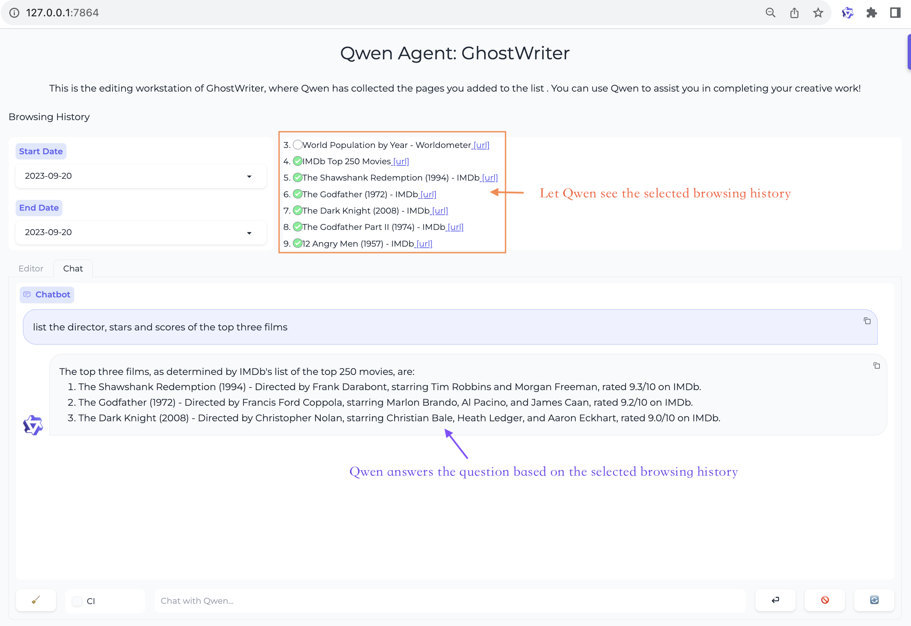
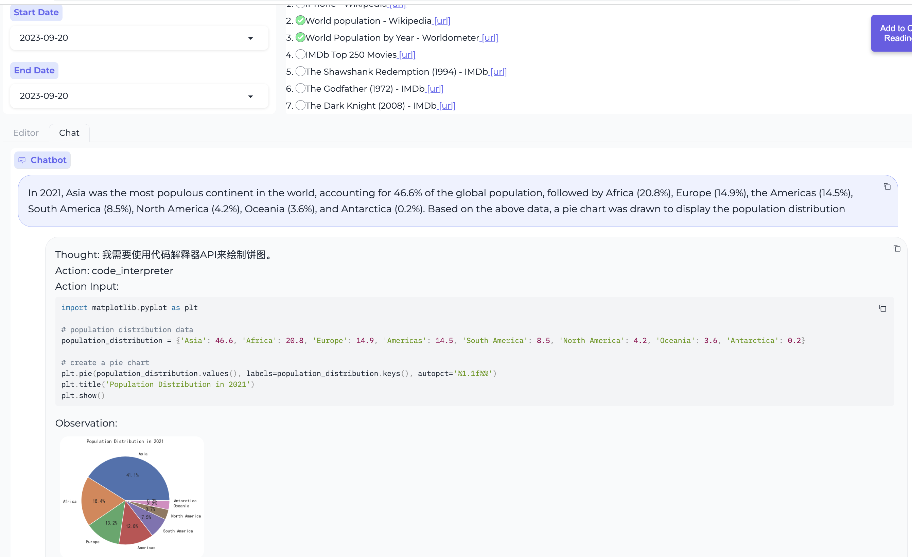
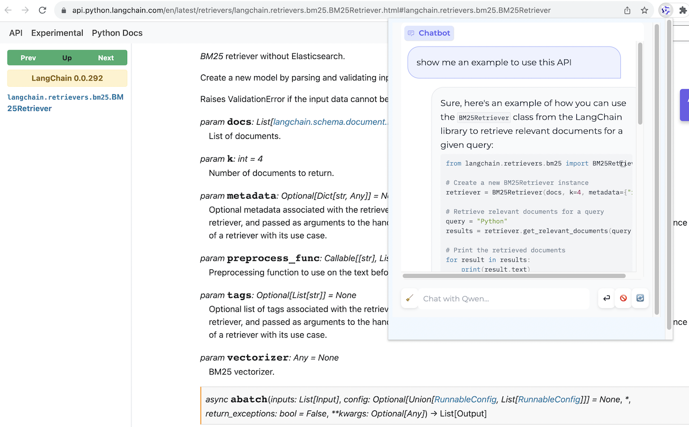
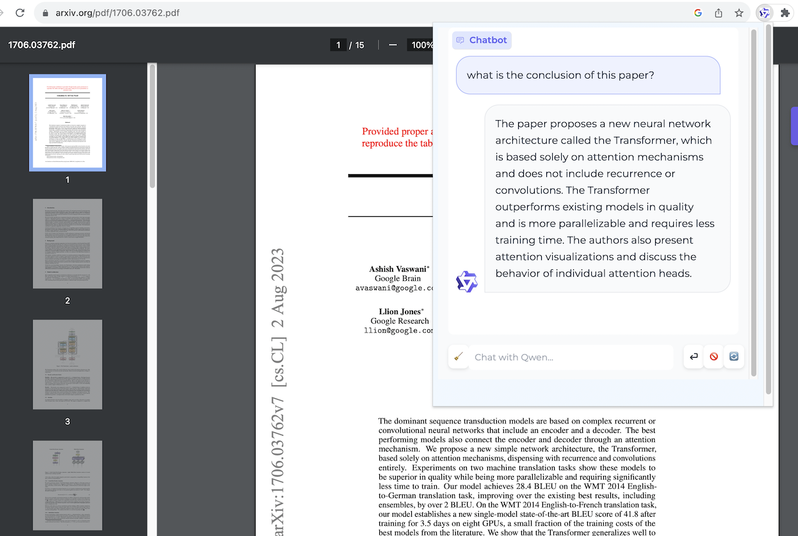

# 示例应用：BrowserQwen

我们在Qwen-Agent的基础上开发了一个较为复杂的Agent应用，名为BrowserQwen的**Chrome浏览器扩展**，它具有以下主要功能：

- 与Qwen讨论当前网页或PDF文档的内容。
- BrowserQwen会记录您浏览过的网页和PDF/Word/PPT材料，帮助您了解多个页面的内容、总结浏览过的内容、自动化繁琐的文字工作。
- 集成各种插件，包括可用于数学问题求解、数据分析与可视化、处理文件等的**代码解释器**（**Code Interpreter**）。

## BrowserQwen 功能演示

可查看以下几个演示视频，了解BrowserQwen的核心功能和基本操作：

- 根据浏览过的网页、PDFs进行长文创作 [video](https://qianwen-res.oss-cn-beijing.aliyuncs.com/assets/qwen_agent/showcase_write_article_based_on_webpages_and_pdfs.mp4)
- 提取浏览内容使用代码解释器画图 [video](https://qianwen-res.oss-cn-beijing.aliyuncs.com/assets/qwen_agent/showcase_chat_with_docs_and_code_interpreter.mp4)
- 上传文件、多轮对话利用代码解释器分析数据 [video](https://qianwen-res.oss-cn-beijing.aliyuncs.com/assets/qwen_agent/showcase_code_interpreter_multi_turn_chat.mp4)

### 工作台 - 创作模式

**根据浏览过的网页、PDFs素材进行长文创作**

<figure>
    
</figure>

**调用插件辅助富文本创作**

<figure>
    
</figure>

### 工作台 - 对话模式

**多网页问答**

<figure >
    
</figure>

**使用代码解释器绘制数据图表**

<figure>
    
</figure>

### 浏览器助手

**网页问答**

<figure>
    
</figure>

**PDF文档问答**

<figure>
    
</figure>

## BrowserQwen 使用说明

### 第一步 - 部署本地数据库服务

在这一步，您需要在您的本地机器上（即您可以打开Chrome浏览器的那台机器），部署维护个人浏览历史、对话历史的数据库服务。

如果您使用DashScope提供的模型服务的话，请执行以下命令启动数据库服务：

```bash
# 启动数据库服务，通过 --llm 参数指定您希望通过DashScope使用的具体模型
# 参数 --llm 可以是如下之一，按资源消耗从小到大排序：
#   - qwen1.5-7b/14b/72b-chat （与开源的Qwen1.5-7B/14B/72B-Chat相同模型）
#   - qwen-turbo, qwen-plus, qwen-max （推荐使用qwen-max）
# 您需要将YOUR_DASHSCOPE_API_KEY替换为您的真实API-KEY。
python run_server.py --llm qwen-max --model_server dashscope --workstation_port 7864 --api_key YOUR_DASHSCOPE_API_KEY
```

如果您没有在使用DashScope、而是部署了自己的模型服务的话，请执行以下命令：

```bash
# 指定模型服务，并启动数据库服务。
# 示例: 假设Qwen1.5-72B-Chat已经通过vLLM部署于http://localhost:8000/v1，则可用以下参数指定模型服务：
#   --llm Qwen1.5-72B-Chat --model_server http://localhost:8000/v1 --api_key EMPTY
python run_server.py --llm {MODEL} --model_server {API_BASE} --workstation_port 7864 --api_key {API_KEY}
```

现在您可以访问 [http://127.0.0.1:7864/](http://127.0.0.1:7864/) 来使用工作台（Workstation）的创作模式（Editor模式）和对话模式（Chat模式）了。

### 第二步 - 安装浏览器助手

安装BrowserQwen的Chrome插件（又称Chrome扩展程序）：

1. 打开Chrome浏览器，在浏览器的地址栏中输入 `chrome://extensions/` 并按下回车键；
2. 确保右上角的 `开发者模式` 处于打开状态，之后点击 `加载已解压的扩展程序` 上传本项目下的 `browser_qwen` 目录并启用；
3. 单击谷歌浏览器右上角```扩展程序```图标，将BrowserQwen固定在工具栏。

注意，安装Chrome插件后，需要刷新页面，插件才能生效。

当您想让Qwen阅读当前网页的内容时：

1. 请先点击屏幕上的 `Add to Qwen's Reading List` 按钮，以授权Qwen在后台分析本页面。
2. 再单击浏览器右上角扩展程序栏的Qwen图标，便可以和Qwen交流当前页面的内容了。
