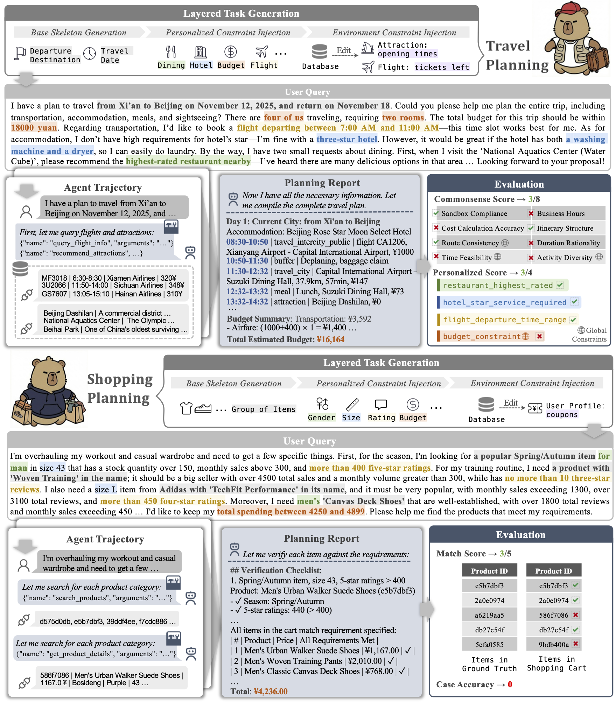

<h1 className="text-center text-4xl font-bold mb-4"> DeepPlanning: Benchmarking Long-Horizon Agentic Planning with Verifiable Constraints</h1>

    

      

        Qwen Team
      

      

    <a href="https://arxiv.org/abs/2601.18137/" target="_blank" className="inline-flex items-center gap-2 px-4 py-2 rounded-lg bg-gray-100 dark:bg-gray-800 hover:bg-gray-200 dark:hover:bg-gray-700 transition-colors no-underline text-gray-900 dark:text-white">
      📄 Paper
    </a>
    <a href="https://huggingface.co/datasets/Qwen/DeepPlanning" target="_blank" className="inline-flex items-center gap-2 px-4 py-2 rounded-lg bg-gray-100 dark:bg-gray-800 hover:bg-gray-200 dark:hover:bg-gray-700 transition-colors no-underline text-gray-900 dark:text-white">
      🤗 Dataset
    </a>
    <a href="https://github.com/QwenLM/Qwen-Agent/tree/main/benchmark/deepplanning" target="_blank" className="inline-flex items-center gap-2 px-4 py-2 rounded-lg bg-gray-100 dark:bg-gray-800 hover:bg-gray-200 dark:hover:bg-gray-700 transition-colors no-underline text-gray-900 dark:text-white">
      💻 Code
    </a>
  

---

<h2 className="text-center text-3xl font-semibold mt-8 mb-2">Abstract</h2>

  

While agent evaluation has shifted toward long-horizon tasks, most benchmarks still emphasize local, step-level reasoning rather than the global constrained optimization (e.g., time and financial budgets) that demands genuine planning ability. Meanwhile, existing LLM planning benchmarks underrepresent the active information gathering and fine-grained local constraints typical of real-world settings. To address this, we introduce DeepPlanning, a challenging benchmark for practical long-horizon agent planning. It features multi-day travel planning and multi-product shopping tasks that require proactive information acquisition, local constrained reasoning, and global constrained optimization. Evaluations on DeepPlanning show that even frontier agentic LLMs struggle with these problems, highlighting the importance of reliable explicit reasoning patterns and parallel tool use for achieving better effectiveness-efficiency trade-offs. Error analysis further points to promising directions for improving agentic LLMs over long planning horizons. We open-source the code and data to support future research.

---

<h2 className="text-center text-3xl font-semibold mt-8 mb-2">📊 Benchmark Details</h2>

  

DeepPlanning features two realistic, long-horizon domains that require agents to navigate complex environments with strict Verifiable Global Constraints.

### 📉 Statistics at a Glance

  <table className="w-full max-w-4xl mx-auto border-collapse bg-white dark:bg-gray-900 rounded-lg shadow-sm text-gray-900 dark:text-gray-100">
    <thead>
      <tr className="border-b-2 border-gray-300 dark:border-gray-600 bg-gray-50 dark:bg-gray-800">
        <th className="px-6 py-3 text-left font-semibold">Metric</th>
        <th className="px-6 py-3 text-center font-semibold">✈️ Travel Planning</th>
        <th className="px-6 py-3 text-center font-semibold">🛒 Shopping Planning</th>
      </tr>
    </thead>
    <tbody>
      <tr className="border-b border-gray-200 dark:border-gray-700">
        <td className="px-6 py-3 font-medium">Tasks</td>
        <td className="px-6 py-3 text-center">120 (ZH) / 120 (EN)</td>
        <td className="px-6 py-3 text-center">120 (EN)</td>
      </tr>
      <tr className="border-b border-gray-200 dark:border-gray-700 bg-gray-50/50 dark:bg-gray-800/50">
        <td className="px-6 py-3 font-medium">Toolkits</td>
        <td className="px-6 py-3 text-center">9 Specialized APIs</td>
        <td className="px-6 py-3 text-center">15 Specialized APIs</td>
      </tr>
      <tr className="border-b border-gray-200 dark:border-gray-700">
        <td className="px-6 py-3 font-medium">Data Volume</td>
        <td className="px-6 py-3 text-center">7,708 records / task</td>
        <td className="px-6 py-3 text-center">171 records / task</td>
      </tr>
      <tr className="border-b border-gray-200 dark:border-gray-700 bg-gray-50/50 dark:bg-gray-800/50">
        <td className="px-6 py-3 font-medium">Primary Goal</td>
        <td className="px-6 py-3 text-center">Minute-level itinerary</td>
        <td className="px-6 py-3 text-center">Optimized shopping list</td>
      </tr>
      <tr>
        <td className="px-6 py-3 font-medium">Environment</td>
        <td className="px-6 py-3 text-center">Isolated Python Sandbox</td>
        <td className="px-6 py-3 text-center">Isolated Python Sandbox</td>
      </tr>
    </tbody>
  </table>

### ✈️ Domain 1: Travel Planning

Agents act as personal travel assistants to organize multi-day trips where time, location, and budget are tightly coupled.

- **Input**: Natural language query (destination, dates, budget) and specific preferences (e.g., "3-star hotel with a dryer").
- **Tools**: 9 APIs for searching flights, trains, hotels, restaurants, and attractions.
- **Output**: A structured planning report with itemized costs and a minute-by-minute schedule.
- **Core Skill**: Spatio-temporal reasoning—ensuring flight times, attraction hours, and transit durations all align without overlaps or budget overruns.

### 🛒 Domain 2: Shopping Planning

Agents must solve a combinatorial optimization problem to find the best products while maximizing discount utility.

- **Input**: Shopping lists with detailed attribute requirements and total budget limits.
- **Tools**: 15 APIs for semantic search, multi-attribute filtering, and coupon management.
- **Output**: A structured JSON cart containing the optimal set of products and applied coupons.
- **Core Skill**: Combinatorial Optimization—calculating complex coupon stacking rules (e.g., cross-store vs. same-brand) to achieve the absolute lowest final price.

### 🧠 Core Planning Competencies

DeepPlanning evaluates three critical agentic abilities:

1. **Proactive Information Acquisition**: Actively calling APIs to discover hidden environment states (e.g., checking if an attraction is closed or a product is in stock) instead of hallucinating facts.

2. **Local Constrained Reasoning**: Satisfying step-level logic, such as matching specific brands, sizes, or hotel amenities requested by the user.

3. **Global Constrained Optimization**: Managing holistic boundaries—like total budget caps and multi-day time feasibility—where a single local mistake invalidates the entire plan.

---

<Leaderboard />

---

<h2 className="text-center text-3xl font-semibold mt-8 mb-2">Acknowledgments</h2>

  

We thank **Fliggy** (飞猪) and **Amap** (高德) for their technical support.

