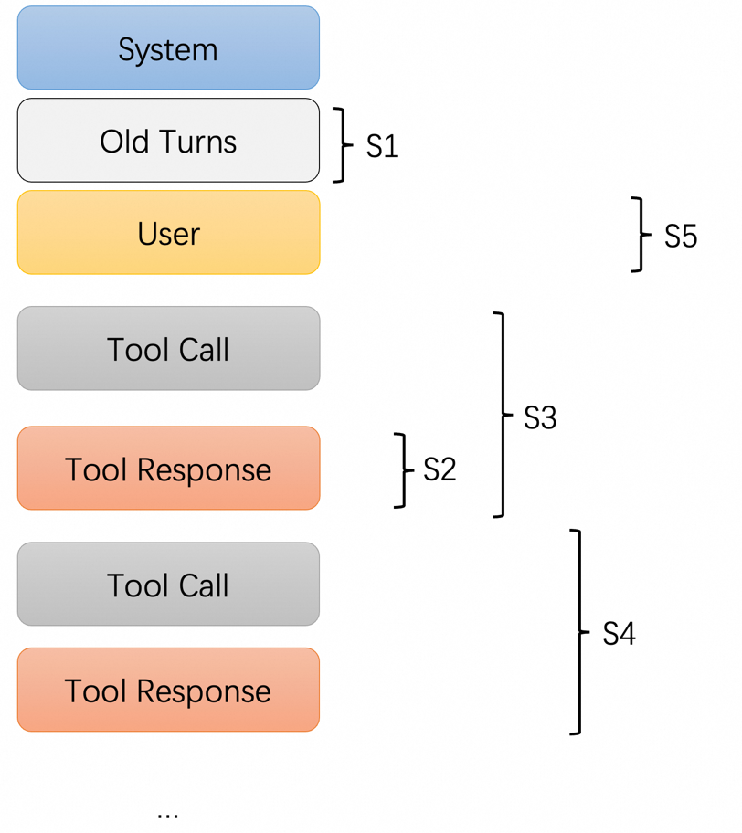

# Context Management

The context management logic of Qwen Agent aims to dynamically truncate input messages while maintaining the rationality of the dialogue structure,
so that the total number of tokens does not exceed the maximum context length supported by the model.

- When calling the `agent.run(...)` or `llm.call(...)` functions, this mechanism will automatically take effect.
- The context will only be modified when the context length reaches [`max_input_tokens`](../../get_started/configuration/).

## Management Strategy
Qwen-Agent follows the following process to modify the context:

- **S1**: Starting from the oldest conversation turn, if removing the entire turn still results in a context that exceeds the length limit, remove that full turn. Otherwise, proceed to S2 to process individual turns.
- **S2**: Starting from the oldest tool-response (excluding the most recent step), fold (compress or summarize) the tool-responses. If the context length becomes acceptable, stop; otherwise, proceed to S3.
- **S3**: Starting from the oldest tool-call step, remove the entire step (excluding the user Query and final Response). If the context length is now within limits, stop; otherwise, proceed to S4.
- **S4**: Process the most recent step by progressively folding its tool-response. If the length requirement is satisfied, stop; otherwise, proceed to S5.
- **S5**: Truncate the User Query or the final Response of this turn.

This strategy prioritizes discarding older memories and environmental information first, progressively reducing context length to enable the Agent to operate effectively within an effectively “infinite context” window.

The above context management strategy enables the agent to operate with effectively unlimited context length;
however, memory recording remains suboptimal. We will soon introduce a more advanced context memory management module.
